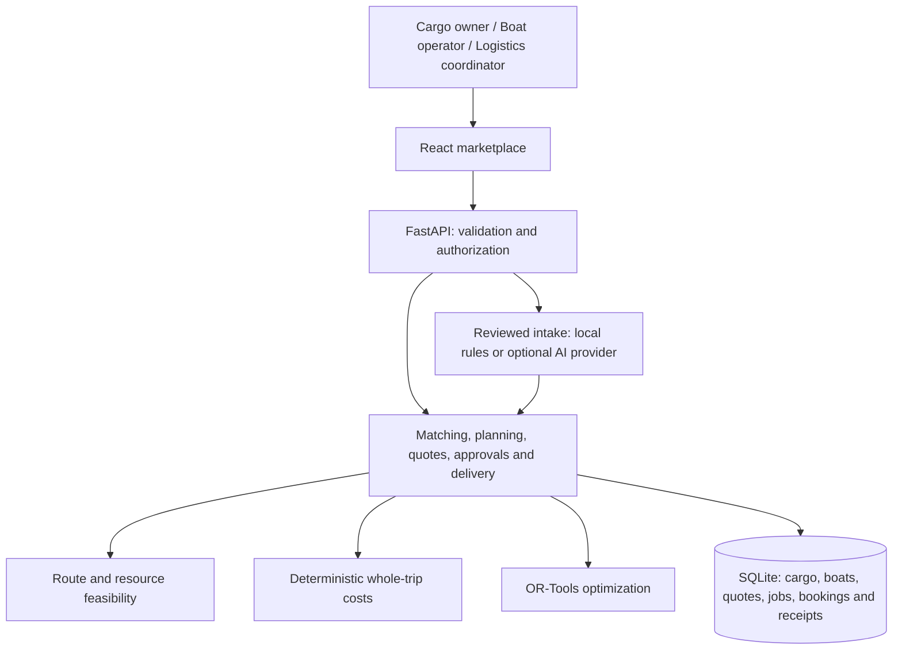

# Jalayatra AI

**An inland freight marketplace that helps cargo owners find available boats, compare road and water delivery costs, and coordinate a shipment from pickup to receipt.**

Built for **IBM x Kerala Government Hackathon 2026 — Challenge 7: Backwater Cargo Exchange**.

Jalayatra connects cargo owners, boat operators, logistics companies, and inland waterway service providers through three simple workspaces. A user can post new cargo, register and list a new boat, request a dated departure, approve the delivery quote, accept the boat assignment, confirm truck and terminal jobs, and record delivery. These actions persist in the application database and remain visible after reloading.

**Current status:** working local prototype. The core journey has been verified with both seeded cargo and a freshly entered boat carrying a new 1-tonne shipment. Transport execution, provider responses, demo certificate reviews, rates, and environmental factors are simulated and labelled in the app.

[Problem statement](#problem-statement) · [Challenge coverage](#challenge-coverage) · [Try the app](#run-locally) · [Demo walkthrough](#demo-walkthrough) · [Verification](#verification) · [Architecture](#architecture-and-technical-approach)

## Problem statement

The following background, challenge, users, features, scenario, and intended impact come from the **challenge image supplied with this project**. A separate [transcription of the supplied brief](data/sources/challenge-7.md) preserves the original wording.

### Background

The brief describes Kerala's extensive inland waterway network, continued reliance on road transport despite the potential cost and environmental benefits of waterways, and a lack of visibility between cargo owners and boat operators.

For a cargo owner, the practical questions are: **Which boat can carry this load? When is it available? What will the complete delivery cost? Who will arrange the connecting trucks and terminal handling?** Operators need visibility into compatible demand and a clear way to accept a departure.

### Challenge

> Build a marketplace-like platform that connects cargo owners with inland water transport operators.

### Target users

- Cargo owners.
- Boat operators.
- Logistics companies.
- Inland waterway service providers.

### Suggested features

1. Cargo posting.
2. Boat availability listing.
3. Matching recommendations.
4. Schedule planning.
5. Cost comparison.

### Example scenario and intended impact

A construction company needs to move building materials **from Kochi to Alappuzha** and compare road transport with waterway options. The intended impact is to **promote sustainable logistics and increase utilization of Kerala's waterways**.

Jalayatra implements that scenario as a complete delivery workflow. The seeded example uses a Kalamassery pickup in the Kochi area, a connecting truck to Maradu terminal, and a waterway journey to Alappuzha. Delivery cost includes the required connecting transport and terminal handling.

## Challenge coverage

All five suggested features are implemented in the current marketplace UI and backed by API services. The [machine-readable coverage manifest](frontend/src/challenge-coverage.json) records the relevant screens, behavior, API paths, source files, tests, and prototype limits. The app also exposes this mapping under **Challenge coverage**.

| Requirement from the brief    | Working behavior                                                                                                                                                                    | Implementation evidence                                                                                                                                                                      |
| ----------------------------- | ----------------------------------------------------------------------------------------------------------------------------------------------------------------------------------- | -------------------------------------------------------------------------------------------------------------------------------------------------------------------------------------------- |
| **Cargo posting**             | Review and save cargo type, weight, volume, route, dates, delivery preferences, and load dimensions. Cargo and its load profile are saved together.                                 | [Cargo form](frontend/src/components/Posting.tsx), [cargo API](backend/api/cargo_lines.py), `POST /api/lines/cargo`                                                                          |
| **Boat availability listing** | Register a new boat with its first availability, or list an existing boat. Edit, pause, and republish unreserved windows from **My boats**.                                         | [Boat registration](frontend/src/components/BoatRegistration.tsx), [availability form](frontend/src/components/AvailabilityPosting.tsx), [vessel APIs](backend/api/routes.py)                |
| **Matching recommendations**  | Search and filter matching boat listings by route and capacity. Check physical, cargo, schedule, and compliance constraints; explain exclusions in the comparison view.             | [Marketplace](frontend/src/components/Marketplace.tsx), [matching engine](optimization/matching/engine.py), [feasibility checks](feasibility/engine.py)                                      |
| **Schedule planning**         | Calculate pickup, loading, departure, and arrival times. Support a preferred departure and compatible shared loads; collect owner, operator, and provider approvals before booking. | [Guided planning](frontend/src/components/CargoLines.tsx), [dated planner](backend/services/line_planning.py), [approval and booking service](backend/services/cargo_lines.py)               |
| **Cost comparison**           | Compare road transport with water plus connecting trucks, terminal charges, waiting allowances, delivery time, and estimated emissions. Show itemized quotes.                       | [Whole-trip cost model](optimization/multimodal/trip_costs.py), `GET /api/lines/cargo/{cargo_id}/advice`                                                                                     |
| **Intended impact**           | Track selected and completed water cargo tonnes from bookings and receipts; estimate the full-delivery CO₂ difference against road transport.                                       | [Logistics workspace](frontend/src/components/LogisticsMarketplace.tsx), [impact calculation](backend/services/cargo_lines.py), [generated example results](data/demo/measured-results.json) |

## How the three workspaces work

| Workspace                 | Main actions                                                                                                                                  | Users served                                                    |
| ------------------------- | --------------------------------------------------------------------------------------------------------------------------------------------- | --------------------------------------------------------------- |
| **Cargo owner**           | Post cargo, browse suitable boats, compare complete costs, request a schedule, approve a quote, and follow bookings.                          | Cargo owners and shipper procurement teams.                     |
| **Boat operator**         | Register a boat, publish availability, discover compatible cargo, review approved revenue, accept or decline requests, and follow departures. | Boat owners and inland water transport operators.               |
| **Logistics coordinator** | Review deliveries, accept or decline each truck and terminal assignment, confirm the booking, record progress, and save individual receipts.  | Logistics companies and coordinated waterway service providers. |

The basic journey is:

**Post cargo → Choose a matching boat → Review costs and dates → Approve the quote → Boat operator accepts → Truck and terminal jobs accepted → Confirm booking → Track delivery → Record receipt.**

The guided checkout shows the next action and approval status. Demo handoffs open the boat's actual operator account. Search filters are cleared during role handoffs so unrelated filters do not hide the next job.

### What makes the workflow useful

- **Complete delivery prices:** boat rates are distinguished from the price including connecting trucks and terminal handling.
- **Feasibility before booking:** matching and confirmation check route restrictions, draft and clearances, capacity, cargo compatibility, dates, terminal resources, and certificate status against the demo network.
- **Compatible shared loads:** owners can combine suitable cargo and share fixed sailing and handling costs, with a separate quote and receipt for each cargo.
- **Explicit commitments:** owner quote approval, the owning boat operator's acceptance, and every required provider job are checked before confirmation.
- **Small shipments work:** a negative estimated sailing contribution is shown to the operator. The operator can explicitly acknowledge the shortfall and accept the approved price; physical and approval checks still apply.
- **Recoverable decisions:** declined or expired proposals can be replanned. A pre-pickup disruption can request a replacement boat with fresh quotes and approvals.
- **Persistent records:** quotes, acceptances, resource assignments, booking references, invoice drafts, milestones, and receipts are stored in SQLite.

## Run locally

**Requirements:** Python 3.12+, Node.js 22.12+ or a supported newer version, and npm. The verified development environment used Python 3.12 and Node.js 24. Internet access is needed to install dependencies; the default cargo-to-delivery demo requires no external AI key.

From the repository root:

### Linux / macOS

```bash
bash scripts/setup.sh
python3 scripts/dev.py
```

### Windows PowerShell

```powershell
powershell -ExecutionPolicy Bypass -File scripts/setup.ps1
python scripts/dev.py
```

Open the app at **http://127.0.0.1:5173**. FastAPI's interactive API documentation is at **http://127.0.0.1:8000/docs**.

The setup scripts install dependencies, initialize the sample network, and generate demo intake documents. The development helper starts the API and frontend on localhost; **Ctrl+C** stops both. API startup initializes an empty database automatically. The default database is `data/jalayatra.db`.

To start the services separately on Linux / macOS, use two terminals:

```bash
# Terminal 1, repository root
.venv/bin/python -m uvicorn backend.main:app --host 127.0.0.1 --port 8000 --reload
```

```bash
# Terminal 2, repository root
cd frontend
npm run dev -- --port 5173 --strictPort
```

On Windows, use `.venv/Scripts/python.exe` instead of `.venv/bin/python` for Python commands. If the helper reports that a service stopped, check for an existing process using ports 8000 or 5173.

## Demo walkthrough

### A. Compare and book the construction-materials example

1. Open **Cargo owner → Browse boats**. Select the seeded **80-tonne cement cargo** and choose **Compare & book** on **MV Vembanad**.
2. Review the itemized road and water delivery prices, truck requirements, route checks, and arrival time. Choose **Continue to schedule planning**.
3. Review the proposed dates. Optionally set a preferred departure, then select the compatible **58-tonne steel cargo** to demonstrate shared-load planning. Choose **Request dated departure**.
4. Approve each cargo's quote. Use **Open boat operator workspace**, review the combined load and dates, then choose **Accept reviewed departure**.
5. Use **Open logistics coordinator workspace**. Record each **Simulate accept** response for the truck and terminal jobs, or use **Simulate remaining provider acceptances**. Each acceptance is persisted separately.
6. Choose **Confirm delivery bundle** after all approvals. Record **Scheduled → Loading → In transit → Unloading**. Enter a receiver name and record a receipt for each cargo.
7. Open **Delivery & impact** to inspect completed tonnes and estimated emissions. Return to **Cargo owner → My bookings** to view the saved booking and invoice draft.

The seeded shared-load example allocates **4 pickup truck jobs and 8 terminal jobs**. Required jobs depend on the load, route, and delivery preferences; other shipments can require a different number.

Quotes have a maximum 20-minute hold and must be confirmed before the departure cutoff. If a quote expires or a provider declines, use the replanning action in **My bookings** to choose a boat and request a fresh quote.

### B. Prove the workflow with fresh entries

1. Open **Boat operator → My boats → Add a new boat**. Enter the name, actual dimensions, capacity, supported cargo, rate, route, and availability dates.
2. For this local demo, explicitly select **simulated registration and insurance review**, review the details, and publish. Without this option, the boat stays pending certificate review and cannot be booked.
3. Switch to **Cargo owner → Post cargo**. Enter a new **1-tonne cement shipment**, its volume, a **0.05-tonne heaviest piece**, and **20 pieces**. Review the actual load dimensions. Choose pickup and delivery dates inside the boat's window, allowing time for handling and transport.
4. Review and post the cargo. Select the new boat, compare costs, request a dated departure, and approve the quote.
5. Follow the operator handoff. If the estimated sailing contribution is negative, review and acknowledge the shortfall before accepting.
6. Follow the logistics handoff, approve each required truck and terminal job, confirm, record milestones, and save the receiver's receipt. Reload **My bookings** to inspect the persisted result.

The browser suite exercises this fresh-entry journey without using the cement sample button or the additive demo loader.

### C. Add examples while keeping existing work

In **Logistics coordinator**, choose **Add demo deliveries**. The additive loader creates labelled sample boats, cargo, and deliveries at different stages. Existing records are preserved. Implementation and preservation checks: [demo loader](backend/services/marketplace_demo.py), [integration tests](tests/integration/test_marketplace_demo.py).

If sample dates in an old database have passed, create fresh entries or add current demo deliveries. To rebuild the entire sample database, stop the API and run the following **only on a disposable demo database**, because it deletes previous records:

```bash
.venv/bin/python scripts/reset_demo.py
```

## Verification

**Latest focused verification, 7 October 2026:** **15 browser scenarios passed, 26 backend checks passed, and the production frontend build passed.** These counts refer to the focused marketplace suite below, rather than every test in the repository.

| Evidence                                                                     | What it checks                                                                                                                                                                                                                                                       |
| ---------------------------------------------------------------------------- | -------------------------------------------------------------------------------------------------------------------------------------------------------------------------------------------------------------------------------------------------------------------- |
| [Browser scenarios](frontend/e2e/demo.spec.ts)                               | Three-role approvals, fresh boat and 1-tonne cargo entry through receipt, persistence after reload, manual availability, editing/pause/resume, operator ownership handoffs, scheduling, provider decline and replanning, search, mobile use, and challenge coverage. |
| [Cargo workflow integration tests](tests/integration/test_cargo_lines.py)    | Quote versions and expiry, ownership, individual provider jobs, preferred departure, selected availability, resource revalidation, small-load acceptance, confirmation, cancellation, recovery, invoices, and receipts.                                              |
| [Operator integration tests](tests/integration/test_operator_marketplace.py) | Atomic boat registration, actual operator ownership, capacity validation, certificate review boundaries, listing edits, visibility, and reserved-window protection.                                                                                                  |
| [Demo loader integration tests](tests/integration/test_marketplace_demo.py)  | Additive examples, preservation of existing records, and demo-only authorization.                                                                                                                                                                                    |
| [Trip-cost unit tests](tests/unit/test_trip_costs.py)                        | Discrete truck trips, minimum charges, shared cost allocation, and modeled sailing economics.                                                                                                                                                                        |

Run the focused backend checks from the repository root:

```bash
.venv/bin/python -m pytest tests/integration/test_cargo_lines.py tests/integration/test_operator_marketplace.py tests/integration/test_marketplace_demo.py tests/unit/test_trip_costs.py -q
```

Run the frontend build:

```bash
cd frontend
npm run build
```

### Run browser checks against a separate database

The browser suite resets its target database before each test. Use a separate API and frontend so it does not erase your working demo. After setup, start these in two terminals from the repository root:

```bash
# Terminal 1
DATABASE_URL=sqlite:////tmp/jalayatra-e2e.db .venv/bin/python -m uvicorn backend.main:app --host 127.0.0.1 --port 8011
```

```bash
# Terminal 2
cd frontend
VITE_API_TARGET=http://127.0.0.1:8011 npm run dev -- --port 5181 --strictPort
```

Then run the suite in a third terminal:

```bash
cd frontend
npx playwright install chromium
PLAYWRIGHT_BASE_URL=http://127.0.0.1:5181 PLAYWRIGHT_API_URL=http://127.0.0.1:8011 npx playwright test e2e/demo.spec.ts
```

For PowerShell, set the same variables with `$env:DATABASE_URL`, `$env:VITE_API_TARGET`, `$env:PLAYWRIGHT_BASE_URL`, and `$env:PLAYWRIGHT_API_URL`. Use a separate database such as `sqlite:///./data/jalayatra-e2e.db` and the Windows Python executable. An existing browser installation can be selected with `PLAYWRIGHT_BROWSERS_PATH`.

The full backend test suite can also be run with `.venv/bin/python -m pytest`. Backend test fixtures use isolated in-memory databases.

## Demonstrated impact

[Generated example results](data/demo/measured-results.json) come from application services, approved quotes, accepted simulated jobs, confirmed bookings, and recorded receipts in isolated SQLite databases.

For the **80-tonne cement + 58-tonne steel** fixture:

| Metric                                              |                               Generated result |
| --------------------------------------------------- | ---------------------------------------------: |
| Cargo carried together                              |                                 **138 tonnes** |
| Boat capacity utilization                           |                    **92%** of a 150-tonne boat |
| Total approved delivered price for both cargoes     |                                 **₹68,518.60** |
| Computed road baseline for both cargoes             |                                 **₹84,285.07** |
| Modeled delivered-cost difference                   |                                 **₹15,766.47** |
| Modeled sailing contribution                        |                                 **₹12,240.00** |
| Accepted provider jobs                              | **12**, including **4 connecting truck trips** |
| Completed cargo from individual receipts            |                                 **138 tonnes** |
| Estimated full-delivery CO₂ difference against road |                                  **723.66 kg** |

These are **reproducible demonstration calculations using synthetic rates, network geometry, operating allowances, and emissions factors**. They are not field-trial results, provider offers, audited profit, or certified environmental savings. Sailing contribution excludes tax, finance, platform overhead, and unbooked return revenue. Connecting trucks are included in the delivery model; the example does not establish a net reduction in actual trucks on the road.

Regenerate the example results from the repository root:

```bash
.venv/bin/python scripts/generate_measured_results.py
```

This script uses isolated databases and rewrites the results JSON; it does not reset the working app database. Sample dates and resource identifiers can change between runs.

## Architecture and technical approach

| Layer                   | Technology and responsibility                                                                                                                |
| ----------------------- | -------------------------------------------------------------------------------------------------------------------------------------------- |
| Frontend                | **React 19, TypeScript, Vite**, responsive CSS, and Lucide icons. Three role-specific marketplace workspaces and a guided delivery checkout. |
| API                     | **Python, FastAPI, Pydantic**. Validated cargo, availability, quote, approval, booking, milestone, and receipt commands.                     |
| Persistence             | **SQLAlchemy + SQLite**. Stored domain records, access scoping, audit events, and serialized writes for the local prototype.                 |
| Feasibility and routing | Deterministic constraints and graph routing for the demo network, vessel, cargo, schedule, and terminal resources.                           |
| Optimization            | **Google OR-Tools CP-SAT** for cargo pooling and fleet assignment; separate matching and whole-trip cost services.                           |
| Optional intelligence   | Local deterministic intake by default; configurable LLM extraction/tool selection and speech-to-text providers.                              |
| Verification            | **pytest** integration/unit checks and **Playwright** browser scenarios.                                                                     |



### AI, constraints, and user review

The optional AI layer assists with interpreting requests and extracting structured fields. In the default `AI_PROVIDER=local` mode, extraction and tool orchestration use deterministic rules; this is **not a trained ML model**.

The repository includes [document intake](intelligence/document_intake/), [Malayalam/mixed-language voice parsing](intelligence/voice_intake/parser.py), and a [bounded broker tool layer](intelligence/broker_agent/agent.py). The simplified marketplace's primary cargo flow is the manual reviewed form; boat availability also exposes a voice/transcript path. An explicitly selected demo transcript is available when live transcription is not configured.

An LLM can extract fields or select allowed tools, but **price calculations, physical feasibility, resource reservations, and booking approvals are enforced by application code**. Pydantic validates extracted data, and users review it before committing changes. Documents are treated as input data, never as instructions to override those rules. Live LLM and speech services require configuration and separate provider validation.

### Main API entry points

The complete schema and request examples are available from the running API's `/docs` and `/openapi.json`.

| Operation                                     | Endpoint                                                                                         |
| --------------------------------------------- | ------------------------------------------------------------------------------------------------ |
| Post cargo with its reviewed load profile     | `POST /api/lines/cargo`                                                                          |
| Register a boat and its first availability    | `POST /api/vessels/with-availability`                                                            |
| List / edit / pause or republish availability | `POST /api/availability`, `PUT /api/availability/{id}`, `POST /api/availability/{id}/visibility` |
| Find matching boats                           | `GET /api/cargo/{cargo_id}/matches`                                                              |
| Compare delivery modes and dates              | `GET /api/lines/cargo/{cargo_id}/advice`                                                         |
| Request a departure                           | `POST /api/lines/proposals`                                                                      |
| Approve the exact owner quote                 | `POST /api/lines/quotes/{quote_id}/approve`                                                      |
| Accept or decline as the owning boat operator | `POST /api/lines/{voyage_id}/operator-response`                                                  |
| Accept or decline a provider assignment       | `POST /api/lines/jobs/{job_id}/response`                                                         |
| Confirm the approved delivery bundle          | `POST /api/lines/{voyage_id}/confirm`                                                            |
| Record delivery progress / receipt            | `POST /api/lines/{voyage_id}/milestone`, `POST /api/lines/{voyage_id}/receipt`                   |
| Read departures and coordinator impact        | `GET /api/lines`                                                                                 |

### Repository guide

| Path                                                                                    | Purpose                                                                           |
| --------------------------------------------------------------------------------------- | --------------------------------------------------------------------------------- |
| [frontend/src/App.tsx](frontend/src/App.tsx) and [components](frontend/src/components/) | Current UI entry point, marketplace screens, forms, and guided workflow.          |
| [backend/api](backend/api/) and [backend/services](backend/services/)                   | API boundaries and application behavior.                                          |
| [backend/models](backend/models/) and [backend/schemas](backend/schemas/)               | Persistent domain models and request validation.                                  |
| [feasibility](feasibility/)                                                             | Vessel, cargo, waterway, terminal, and compliance checks.                         |
| [optimization](optimization/)                                                           | Matching, costs, pooling, fleet assignment, and related planners.                 |
| [intelligence](intelligence/)                                                           | Reviewed document/text/voice intake, provider adapters, and bounded broker tools. |
| [data/seed/network.py](data/seed/network.py)                                            | Synthetic network, users, cargo, vessels, and dated availability.                 |
| [data/sources](data/sources/)                                                           | Supplied challenge transcription and data provenance.                             |
| [tests](tests/) and [frontend/e2e](frontend/e2e/)                                       | Backend checks and browser evidence.                                              |
| [scripts](scripts/)                                                                     | Setup, local startup, reset, provider smoke checks, and evidence generation.      |
| [design-system/jalayatra/MASTER.md](design-system/jalayatra/MASTER.md)                  | UI design decisions and interaction rules.                                        |

Additional backend modules cover scheduled services, backhaul discovery, recurring capacity, fleet planning, and analytics. Their source and tests are available in the repository; the current three-role marketplace keeps its main navigation focused on the challenge workflow.

## Configuration, data, and prototype boundaries

Copy [.env.example](.env.example) to `.env` only when customizing the defaults. [Configuration definitions](backend/config.py) and [provider adapters](intelligence/provider/llm.py) show the supported settings and behavior.

| Configuration                              | Default / purpose                                                          |
| ------------------------------------------ | -------------------------------------------------------------------------- |
| `DEMO_MODE`                                | `true`: switchable local demo identities and demo-only controls.           |
| `DATABASE_URL`                             | `sqlite:///./data/jalayatra.db`: local persistent application data.        |
| `AI_PROVIDER`                              | `local`: deterministic intake without external AI credentials.             |
| `LLM_BASE_URL`, `LLM_MODEL`, `LLM_API_KEY` | Optional chat-completions-compatible provider.                             |
| `STT_URL`, `STT_API_KEY`, `STT_PROVIDER`   | Optional speech-to-text provider.                                          |
| `TRACKING_PROVIDER`, `WEATHER_PROVIDER`    | Demo by default; configurable adapters are not proof of a live deployment. |
| `AUTH_SECRET`                              | Required for signed bearer identities outside demo mode.                   |
| `ENFORCE_CERTIFICATES`                     | `true`: certificate checks remain enabled.                                 |

Demo role selection is for local evaluation. Outside demo mode, the backend uses signed, expiring bearer identities and organization-based access checks; production identity provisioning and SSO still need implementation. Demo boat registration can simulate certificate review only when demo mode is enabled.

The [data provenance record](data/sources/provenance.json) distinguishes source-grounded corridor context from synthetic operational fixtures. Depths, availability, rates, provider responses, shipment progress, and emissions factors used in the demo must not be interpreted as live operational measurements.

### Next development priorities

1. **Validate a real corridor pilot:** collect operator rates, actual vessel certificates, current waterway restrictions, terminal capacity, and measured delivery outcomes.
2. **Connect providers:** real truck/terminal acceptance, GPS and weather feeds, payments, and external certificate verification.
3. **Prepare deployment:** production identity provisioning, PostgreSQL migration and concurrency validation, monitoring, backups, and a secure hosted environment.
4. **Evaluate intelligence:** validate configured Malayalam speech and document extraction with representative user data and provider failure cases.

These are future integration and validation steps. The current submission demonstrates the complete challenge workflow locally with persisted application records and reproducible verification evidence.
