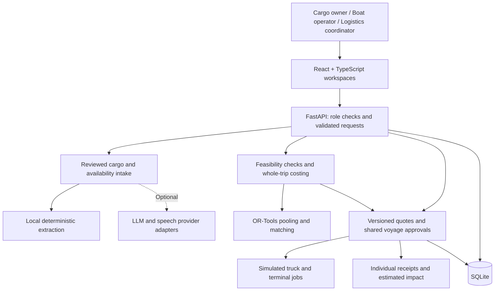

# Jalayatra AI

**A cargo marketplace that helps Kerala's shippers and boat operators turn compatible loads into a shared, costed waterway departure.**

IBM × Kerala Government Hackathon 2026

**Challenge:** 7 — Backwater Cargo Exchange

**Team number:** Awaiting team information.

**Repository:** https://github.com/Dony-sunny/keralAI_hack (configured Git remote; public access not verified).

**Project status:** Runnable React + FastAPI prototype with simulated logistics execution. The default demo requires no AI credentials. Optional LLM support exists; IBM watsonx.ai integration is a planned enhancement.

The flagship scenario combines **80 t of cement and 58 t of steel** on a **150 t vessel**, compares complete delivery costs, collects customer/operator/provider approvals, and records individual receipts. The reproduced synthetic scenario yields **92% utilization**, **₹12,240 modeled sailing contribution**, and **₹15,766.47 lower modeled delivery cost** than its road baseline. These are application calculations using demo assumptions.

**App screenshot:** Pending capture. Use the local demo in Section 5 to review the current application.

## 1. Problem Statement

A cargo owner needs a delivered price and an arrival window. Moving construction material from Kochi to Alappuzha by water also requires compatible vessel capacity, usable terminals, handling resources, and connecting trucks. Separate conversations leave the shipper to reconcile those dependencies.

Boat operators face another challenge: individual loads may not cover a sailing's costs. Combining loads can improve utilization when capacity, cargo compatibility, timing, and handling constraints permit it. Logistics coordinators need visibility into who has accepted each job and what still blocks confirmation. Jalayatra demonstrates a shared workflow for these decisions using synthetic corridor data.

## 2. Our Solution

Jalayatra connects cargo owners, boat operators, and logistics coordinators in three workspaces. A shipper posts cargo, compares feasible boats and complete road/water quotes, and requests a dated departure with compatible loads. The operator reviews the combined load and modeled contribution; the coordinator collects simulated truck and terminal acceptances before confirming the bundle. Each customer's accepted quote, arrival time, and receipt remain traceable.

**Why this solution?** The marketplace connects price comparison to the resources and approvals needed to execute a delivery. It evaluates utilization and financial viability separately and can recommend road when the configured constraints or economics favor road.

### Architecture Diagram



AI supports reviewed intake and explanations. Deterministic code owns constraints, cost arithmetic, scheduling, and booking approval rules.

## 3. Technology Used

| Technology | How it is used |
| --- | --- |
| React 19, TypeScript, Vite | Workspaces, marketplace, planning, and delivery UI |
| Python, FastAPI, Pydantic | APIs, validation, authorization, and workflow services |
| SQLAlchemy + SQLite | Persisted cargo, vessels, quotes, voyages, jobs, and receipts |
| Google OR-Tools CP-SAT | Compatible cargo pooling and assignment optimization |
| Leaflet / React Leaflet, Recharts | Route display and analytics; schematic map fallback |
| pypdf and local OCR workers | Document intake with reviewed extraction |
| Optional LLM and speech adapters | Structured extraction and transcription when configured |
| pytest and Playwright | Backend behavior and browser workflow checks |
| IBM watsonx.ai / Granite — planned | Proposed reviewed extraction and grounded explanations; native integration and credentialed validation remain to be implemented |

The default `AI_PROVIDER=local` uses deterministic extraction and orchestration. The optional provider boundary is implemented in [intelligence/provider/llm.py](intelligence/provider/llm.py); no credential-tested external LLM or Malayalam speech connection is claimed.

## 4. Features

### Challenge alignment

| Brief capability | User value | Implementation evidence |
| --- | --- | --- |
| Cargo posting | Review load details, endpoints, and deadlines before planning | [Intake UI](frontend/src/components/Intake.tsx), [cargo APIs](backend/api/routes.py) |
| Boat availability listing | Publish capacity, corridor, and dated availability | [Availability UI](frontend/src/components/AvailabilityPosting.tsx), [intake APIs](backend/api/intake.py) |
| Matching recommendations | Compare feasible boats and inspect rejection reasons | [Matching engine](optimization/matching/engine.py), [feasibility engine](feasibility/engine.py) |
| Schedule planning | Request a shared departure with resource checks and individual delivery times | [Line planning](backend/services/line_planning.py), [voyage workflow](backend/services/cargo_lines.py) |
| Cost comparison | Compare full road and water/truck costs, including connecting trips and setup charges | [Trip costs](optimization/multimodal/trip_costs.py), [advice API](backend/api/cargo_lines.py) |
| Sustainable logistics | Inspect selected/completed demo tonnes and labeled emissions estimates | [Impact service](backend/services/cargo_lines.py), [demo evidence](data/demo/measured-results.json) |

### Additional prototype capabilities

- **Reviewed intake:** manual, text, document, and Malayalam availability flows, including an explicit transcript fallback when speech services are unavailable.
- **Transparent feasibility:** draft, vessel dimensions, cargo compatibility, terminal resources, and timing checks against demo data.
- **Versioned approvals:** owners approve exact quotes, operators accept reviewed departures, and required simulated provider jobs accept before confirmation.
- **Shared resources:** cancellation preserves necessary common resources and the remaining member's accepted price in the tested Cargo Lines flow.
- **Whole-trip economics:** discrete truck trips, shared setup charges, integer minor-unit quote amounts, and modeled contribution.
- **Pre-pickup recovery:** replacement proposals require new customer quotes, replacement-operator approval, and provider acceptance.
- **Traceable completion:** individual receipts distinguish selected quantities from completed demo quantities.

The [coverage manifest](frontend/src/challenge-coverage.json) and [Cargo Lines integration tests](tests/integration/test_cargo_lines.py) provide reviewable evidence. Live dispatch, payments, government verification, and IBM integration are future enhancements.

## 5. Demo

**Video demo:** Awaiting recording/link.

The scenario follows cement and steel from comparison through one shared departure to individual receipts. Watch for the deep-draft vessel rejection, complete cost comparison, separate approvals, and selected-versus-completed impact.

1. Open **Demo & settings → Reset demo transactions** on a disposable demo database.
2. In **Cargo owner**, choose the seeded **80 t cement** cargo. Compare boats and delivery costs; inspect MV Deep Blue's draft rejection.
3. Continue to schedule planning, suggest compatible loads or select **58 t steel**, and request a dated departure. Approve both exact customer quotes.
4. In **Boat operator**, review **138 t / 92% utilization** and modeled contribution, then accept the reviewed departure.
5. In **Logistics coordinator**, simulate remaining provider acceptances. The fixture has **four pickup truck jobs and eight terminal jobs**. Confirm after every required approval.
6. Record Scheduled → Loading → In transit → Unloading milestones and each customer's receipt. Inspect **Delivery & impact**.
7. For a separate recovery example, withdraw the vessel before pickup and request replacement quotes. The replacement's own operator and all new jobs must accept.

To try fresh entries, use **Boat operator → My boats → Add a new boat**, explicitly select the simulated certificate review, then post a new cargo request in the cargo-owner workspace. Small loads require operator acknowledgement of any modeled sailing shortfall. **My bookings** supports restarting declined or expired quotes.

Provider responses, tracking, certificate reviews, and deliveries are simulated. Quotes expire within 20 minutes and before cutoff; local bundle confirmation is idempotent.

## 6. Prerequisites

| Requirement | Details |
| --- | --- |
| Python | 3.12+ |
| Node.js | 22+; the existing setup records Node 24 usage |
| npm | Frontend dependency installation |
| Git | Repository clone |
| Database | SQLite; no separate database server required |
| Internet | Initial dependency installation and optional external services |
| AI credentials | Optional; the default demo runs without them |
| Docker | Optional future packaging; currently absent |

## 7. Installation & Setup

### Clone the repository

```bash
git clone https://github.com/Dony-sunny/keralAI_hack.git
cd keralAI_hack
```

The URL is the configured remote. If access is unavailable, use the provided local project folder.

### Windows PowerShell

```powershell
powershell -ExecutionPolicy Bypass -File scripts/setup.ps1
python scripts/dev.py
```

### Linux / macOS

```bash
bash scripts/setup.sh
python3 scripts/dev.py
```

Setup installs dependencies, initializes demo data, and generates sample documents. Startup also seeds an empty database. Copy `.env.example` to `.env` only when customizing the defaults.

- **Application:** http://127.0.0.1:5173
- **Interactive API documentation:** http://127.0.0.1:8000/docs
- **Backend health:** http://127.0.0.1:8000/api/health

The launcher reuses healthy Jalayatra services and starts missing services. Ctrl+C stops services it started. If another application owns either port, the launcher reports the conflict. For **WinError 10048**, check the health endpoint and reuse the running backend or stop its original terminal before restarting.

To start services separately on Windows, use two terminals:

```powershell
.venv/Scripts/python.exe -m uvicorn backend.main:app --host 127.0.0.1 --port 8000
```

```powershell
cd frontend
npm run dev
```

On Linux/macOS, use `.venv/bin/python` for the backend command.

### Verification and reset

```powershell
.venv/Scripts/python.exe -m pytest -p no:cacheprovider
cd frontend
npm run build
npx playwright install chromium
npm run test:e2e
```

Browser checks require both local services and reset the demo database. Backend tests use isolated databases.

Focused verification performed for this README on **7 October 2026** passed **17 tests** with the following command:

```powershell
.venv/Scripts/python.exe -m pytest -p no:cacheprovider tests/integration/test_cargo_lines.py tests/unit/test_trip_costs.py
```

The focused run reported one third-party Starlette/httpx deprecation warning. The full suite, frontend build, and browser suite were not rerun for this documentation update.

Reset through demo settings, or stop the API and run `.venv/Scripts/python.exe scripts/reset_demo.py`. This deletes previous demo transactions. Seed without resetting with `.venv/Scripts/python.exe -m data.seed.network`.

## 8. Run with Docker

Docker packaging is not implemented. Use the native setup in Section 7; there is no supported Docker Compose evaluation path yet.

## 9. Environment Variables

Use [.env.example](.env.example) as the configuration reference. Supported settings are loaded by [backend/config.py](backend/config.py).

| Variable | Default / purpose |
| --- | --- |
| `DEMO_MODE` | `true`; switchable local demo identities |
| `DATABASE_URL` | `sqlite:///./data/jalayatra.db` |
| `AI_PROVIDER` | `local`; deterministic default behavior |
| `LLM_BASE_URL`, `LLM_MODEL`, `LLM_API_KEY` | Optional compatible LLM endpoint, model, and secret |
| `STT_URL`, `STT_API_KEY`, `STT_PROVIDER` | Optional speech service; provider defaults to `auto` |
| `PROVIDER_TIMEOUT_SECONDS` | `8`; request timeout |
| `TRACKING_PROVIDER`, `TRACKING_URL`, `TRACKING_API_KEY` | Tracking defaults to `demo` |
| `WEATHER_PROVIDER`, `WEATHER_URL`, `WEATHER_API_KEY` | Weather defaults to `demo` |
| `CORS_ORIGINS` | Local frontend origins on port 5173 |
| `AUTH_SECRET` | Strong secret required for signed identities outside demo mode |
| `ENFORCE_CERTIFICATES` | `true`; checks stored prototype certificate records |

Keep credentials on the backend and out of version control. Demo mode is for local evaluation. Production identity provisioning remains future work. IBM-specific variables from the PDF template are omitted because the current backend does not consume them.

## 10. Data Sources

| Source | Use and limitations |
| --- | --- |
| [Synthetic network seed](data/seed/network.py) | Vessels, cargo, terminals, and corridor constraints |
| [Tariff model](optimization/multimodal/trip_costs.py) | Synthetic truck, sailing, and handling terms |
| [Provenance manifest](data/sources/provenance.json) | Records IWAI corridor-context and terminal-name references |
| [Generated demo results](data/demo/measured-results.json) | Quotes, approvals, receipts, and estimated impact in simulated scenarios |
| Reviewed user inputs | Cargo and availability subject to schema and ownership checks |

### Data Quality & Attribution

Coverage is a seeded Kerala corridor demonstration. Fixtures have no live update guarantee; geometry, depths, tariffs, operating terms, and emissions factors are synthetic. The provenance manifest marks navigation, GPS, government, weather, and payment integrations as not live. Generated documents and certificate-related records carry prototype status. Review source-specific licensing before adding external datasets to a deployment.

## 11. Project Structure

```text
jalayatra/
├── frontend/       React workspaces, maps, and browser tests
├── backend/        FastAPI APIs, models, authorization, and services
├── intelligence/   Reviewed intake, provider adapters, and broker tools
├── feasibility/    Vessel, waterway, cargo, terminal, and compliance checks
├── optimization/   Matching, pooling, trip costs, and schedule planning
├── data/           Synthetic seed, provenance, and generated evidence
├── tests/          Unit and integration tests
├── scripts/        Setup, launcher, reset, and evidence generation
├── docs/           Existing implementation review
├── .env.example    Supported configuration variables
└── README.md       Project and evaluation guide
```

Current source and reproducible tests establish capability claims. The existing implementation review describes an earlier state; assess the newer Cargo Lines workflow using its current implementation and tests.

## 12. Team

Team number, member names, and verified contributions were not supplied. Complete these details before submission.

| Submission detail | Status |
| --- | --- |
| Team number | Awaiting team information |
| Member names and contributions | Awaiting team information |
| Demo video | Awaiting recording/link |
| Application screenshots | Awaiting capture |

## 13. Key Impact

These values were reproduced from application services during this README update. **Rates, geometry, operating terms, provider events, and emissions factors are synthetic.**

| Metric | Demo result | Interpretation |
| --- | --- | --- |
| Shared cargo | 138 t on a 150 t vessel | 92% modeled utilization |
| Customer delivery total | ₹68,518.60 | Combined accepted simulated quotes |
| Equivalent road baseline | ₹84,285.07 | Complete modeled road delivery scope |
| Delivery cost difference | ₹15,766.47 | Scenario-specific estimated benefit |
| Sailing contribution | ₹12,240.00 | Revenue minus modeled payables and operating allowances |
| Standalone 58 t contribution | −₹560.00 | An available sailing can lose money under the model |
| Required provider jobs | 12 | Four pickup truck jobs and eight terminal jobs |
| Estimated full-delivery CO₂ difference | 723.66 kg | Synthetic tonne-km estimate |
| Long-haul truck equivalents / connecting trips | 7 / 4 | Separate quantities; no net truck-removal claim |
| Completed cargo in simulated receipts | 138 t | Recorded demo completion |

Contribution excludes tax, finance, platform overhead, and unbooked return revenue. The 62 t coir return opportunity is excluded from contribution and impact. Cost crossover ranges depend on the scenario and discrete truck charges.

Reproduce and update the evidence file from the repository root:

```powershell
.venv/Scripts/python.exe scripts/generate_measured_results.py
```

On Linux/macOS, use `.venv/bin/python`. The script uses isolated SQLite fixtures and writes [data/demo/measured-results.json](data/demo/measured-results.json).

The workflow demonstrates explicit job ownership, reviewable rejection reasons, and an approval trail across three roles. Actual time savings, adoption, delivery reliability, and environmental impact require a field pilot.

## 14. Future Enhancements

- **IBM watsonx.ai / Granite:** implement and credential-test an IBM-specific adapter for reviewed extraction and grounded explanations, retaining local fallback.
- **Verified corridor pilot:** obtain accepted operator, terminal, and trucking terms, verified navigation data, and real shipper demand.
- **Durable provider reservations:** external hold/commit/release, expiry, idempotency, retries, and reconciliation.
- **Recovery after pickup:** replan from verified custody and remaining legs with explicit service and price amendments.
- **Production infrastructure:** PostgreSQL migrations and concurrency validation, identity provisioning, monitoring, and Docker packaging.
- **Live operational services:** verified GPS, weather/navigation feeds, payment settlement, and authorized statutory integrations.
- **Field evaluation:** measure quote-to-confirmation time, realized costs, actual delivery reliability, and corridor utilization.

## 15. License

No `LICENSE` file is currently present. The team must select and add reuse terms before claiming MIT or another license.

Prepared for IBM × Kerala Government Hackathon 2026 using the supplied README template structure and project-specific implementation evidence.
