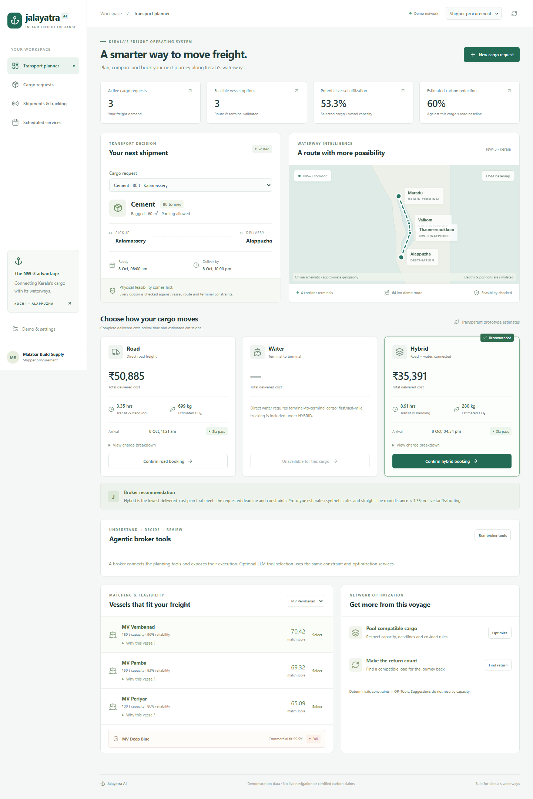

# Jalayatra AI

**Kerala's Agentic Inland Freight Exchange & Multimodal Logistics Operating System**

A working React + FastAPI freight prototype: describe or upload cargo, review Malayalam operator availability, validate the waterway and terminal constraints, compare full delivered costs, pool loads, find return cargo, book, execute and measure impact.



## Start locally

Requirements: Python 3.12+, Node 22+ (tested with Node 24), npm. Internet is needed to install dependencies once. No AI/API key is required for the demo.

Windows PowerShell, from this repository:

```powershell
powershell -ExecutionPolicy Bypass -File scripts/setup.ps1
python scripts/dev.py
```

Linux/macOS:

```bash
bash scripts/setup.sh
python3 scripts/dev.py
```

Open **http://127.0.0.1:5173**. Interactive API documentation: **http://127.0.0.1:8000/docs**. Startup seeds an empty database automatically. Stop the helper with Ctrl+C. Both services bind to localhost.

If starting separately:

```powershell
.venv/Scripts/python.exe -m uvicorn backend.main:app --host 127.0.0.1 --port 8000
```

In a second terminal: `cd frontend` then `npm run dev`. For a production frontend bundle, run `npm run build` in `frontend`. This repository is a local prototype, not a production deployment.

## Reproduce the flagship demo

1. Switch to **Platform admin** and click **Reset demo transactions**.
2. Switch to **Vessel operator**, select **Voice availability**, click **Use demo transcript**, review the 150 t Kochi → Alappuzha extraction and confirm the suggested operating window. This is a disclosed transcript fallback, not live speech recognition.
3. Switch to **Shipper procurement**. The 80 t cement request is preloaded. Use **New cargo request** for text, PDF, manual or CSV intake. Files in `data/demo` are safe samples; run `python scripts/make_demo_documents.py` to generate the PDF and a dated CSV.
4. Expand **MV Deep Blue**: its attractive commercial fit cannot override the draft failure. MV Vembanad passes the configured physical constraints.
5. Inspect road, water and hybrid. Direct water is unavailable for a door pickup; hybrid includes the connecting truck. With terminal-to-terminal cargo, water is available. Urgent cargo can cause road to win.
6. Click **Optimize**: 80 + 58 = **138 t**, **92%** of the 150 t vessel. Click **Find return**: a **62 t coir** load fits the return window.
7. Click **Confirm pooled hybrid booking**. Both cargo records receive bookings, shipments, invoice drafts and impact records in one transaction.
8. Switch to **Shipper dispatch** or **Captain**. Advance each shipment through scheduled → loading → in transit → unloading → delivered. Required last-mile cargo has an additional last-mile milestone.
9. Switch to **Government analytics**. **138 t** selected for water is derived from those two bookings. Completed tonnage increases only as shipments finish. No transaction means zero shifted cargo, savings or avoided CO₂.
10. For recovery, reset, book an individual hero request, switch to dispatch, and simulate cancellation or route closure. Review options and explicitly approve one. Recovery is a pre-departure prototype.

Full timing and A–F scenario instructions: [Demo script](docs/DEMO_SCRIPT.md).

## What is implemented

| Area | Working behavior |
|---|---|
| Intake | Validated manual cargo/vessel creation; natural-language text; text-based PDF/TXT; image-provider abstraction; CSV bulk preview; native/transliterated Malayalam extraction; audio upload/recording with configurable STT and explicit fallback |
| Feasibility | Dijkstra route graph; draft/safety margin, air draft, width, locks, deadlines, terminal slots/capabilities, cargo compatibility, maintenance, verified registration/insurance expiry |
| Matching | Feasible candidates ranked with configurable profiles, score factors and readable rejection evidence |
| Procurement | Multiple computed quotes, complete road/water/hybrid cost lines, ETA/SLA, transparent carbon factors and deterministic booking risk |
| Optimization | OR-Tools CP-SAT pooling; return-window backhaul; terminal-pair evaluation; scheduled stops and segment-capacity enforcement |
| Execution | Atomic bookings and reservations; actual state transitions; simulated route positions; handovers, volume verification, receipt/discrepancy records, prototype JSON documents |
| Recovery | Vessel cancellation, route closure and terminal closure; revalidated replacement/fallback options; explicit approval |
| Intelligence | Booking-derived impact, failed-match demand, heatmap, terminal opportunity scores, modal-shift evaluation and simulated flood controls |
| Roles | All 15 workspaces; organization/user/role models; backend scope checks and redacted commercial fields |
| Reliability | Offline schematic map, optional OSM tiles, no mandatory external AI, seed/reset commands, unit/integration/browser tests, CI |

Advanced role features are explicitly mapped to implemented behavior or architecture in [Workspace coverage](docs/WORKSPACE_COVERAGE.md); roadmap integrations are not represented as connected.

## AI and operational truth

Default `AI_PROVIDER=local` uses deterministic extraction and tool orchestration, **not ML**. An optional chat-completions-compatible LLM can extract structured fields, interpret image documents and select bounded broker tools. Pydantic validates all extracted fields. The LLM never supplies navigation values, totals or safety overrides. OR-Tools and hard constraints remain separate.

Copy `.env.example` to `.env` only if customizing configuration. Configure `AI_PROVIDER`, `LLM_BASE_URL`, `LLM_MODEL`, `LLM_API_KEY` and optionally `STT_URL`/`STT_API_KEY`. `STT_URL` accepts a multipart `file` and `language=ml` and returns `{"text":"..."}`. ChatGPT subscriptions do not provide an API credential. No external provider was credential-tested here.

**Demo identity is intentionally switchable.** Do not expose demo mode publicly. Outside demo mode, the backend requires signed, expiring bearer identities and a strong `AUTH_SECRET`; production identity provisioning/SSO is roadmap work. See [Security](docs/SECURITY.md).

## Tests and reset

```powershell
.venv/Scripts/python.exe -m pytest -p no:cacheprovider
cd frontend
npm run build
npx playwright install chromium
npm run test:e2e
```

Browser tests require the two local services and reset the demo database. If using a workspace browser installation, set `PLAYWRIGHT_BROWSERS_PATH` to its path. Backend tests use isolated in-memory databases. See [Testing](docs/TESTING.md).

Reset from the admin UI, or stop the API and run `.venv/Scripts/python.exe scripts/reset_demo.py`. This intentionally deletes previous **demo** records. Seed without deleting records: `.venv/Scripts/python.exe -m data.seed.network`.

## Repository and submission

`backend` contains APIs, SQLAlchemy models, schemas and services. `intelligence`, `feasibility` and `optimization` hold separate reasoning/constraint/solver layers. `data`, `tests`, `scripts`, `frontend` and `docs` provide fixtures and the reproducible artifact. SQLite can be replaced through `DATABASE_URL`; a PostgreSQL migration still needs a driver, migrations and concurrency validation.

- [Architecture](docs/ARCHITECTURE.md) · [AI & optimization](docs/AI_AND_OPTIMIZATION.md) · [API](docs/API.md)
- [Provenance](docs/DATA_PROVENANCE.md) · [Security](docs/SECURITY.md) · [Known limitations](docs/KNOWN_LIMITATIONS.md)
- [Hackathon submission](docs/HACKATHON_SUBMISSION.md) · [9-slide outline](docs/PRESENTATION_OUTLINE.md) · [Judge Q&A](docs/JUDGE_QA.md)
- [Roadmap](docs/FUTURE_ROADMAP.md) · [Measured demo output](data/demo/measured-results.json)

This is a Git-initialized, GitHub-ready local repository. No remote repository or hosted deployment has been published.
