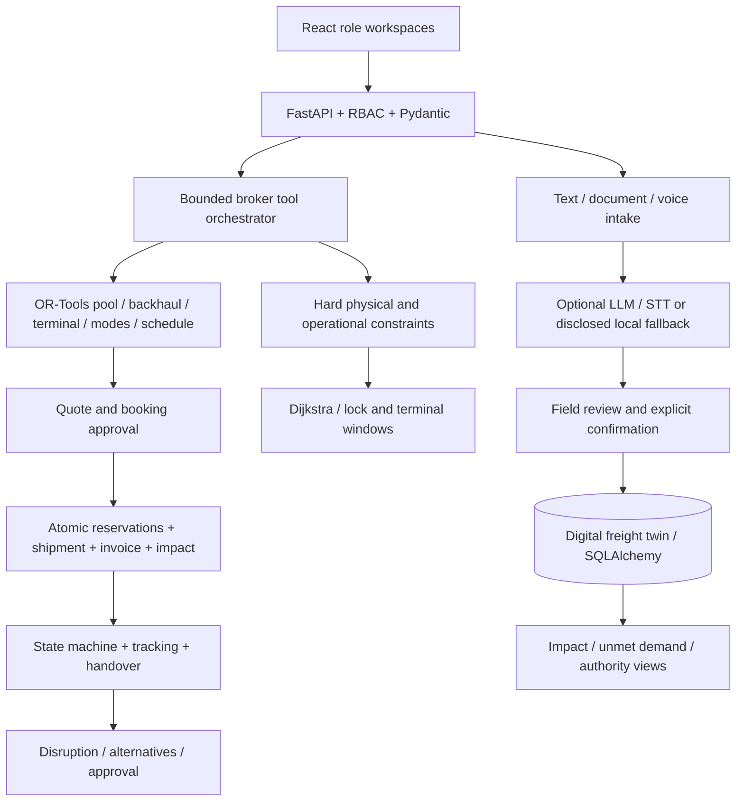

# Architecture

One freight twin connects role workspaces to shared application records. React/TypeScript/Vite renders forms, Leaflet route maps and Recharts demand charts. FastAPI validates requests, resolves the actor, applies role permissions and scopes organization records. SQLAlchemy persists to SQLite with foreign keys and write serialization.

The LLM is a broker/intake boundary; tool services own truth. The broker exposes only bounded read/preview tools. Booking and recovery are separate authenticated, explicitly approved API calls. Provider responses are untrusted JSON; no arbitrary tool name, Python execution, file path or SQL can enter through the model.

## Data flow

Extraction does not create demand. It returns nullable structured fields, heuristic confidence, missing fields and provenance. Confirmation creates CargoRequest. Operator speech changes a listed VesselAvailability after selecting a registered vessel; speech cannot alter draft or compliance. Matching runs feasibility before ranking. A booking rechecks all constraints under a write lock, snapshots the approved plan, creates shipment/legs/events/terminal reservations/invoice/payment/impact, and commits together.

Pooling previews do not reserve cargo. A confirmed pool creates individual bookings for all accessible cargo in one transaction. Tenant authorization is checked for each member; a shipper cannot approve a competitor's cargo. A 3PL/admin actor can coordinate across organizations in the demo.

Scheduled service capacity is checked per stop-to-stop segment, including residual commercial contract holds. Dated patterns copy stop offsets and create concrete service/availability instances. Recurring approval reserves all selected dates together or rolls everything back. Shared service berth/equipment reservations can coexist while storage and capacity sum; cargo compatibility/volume remain enforced. Individual recovery removes stale pool membership; whole-pool recovery revalidates combined cargo and updates every member atomically.

## Roles and tenants

Organization, User and Role are separate entities. Roles are stored in the database; backend permission sets enforce actions. Shippers see their requests and commercial records. Operators see their own vessels and calculated opportunities, without competitor budgets/quotes. Captains see assigned cargo, milestones and approved routes, with financial fields removed. Warehouse/receiver do not have policy analytics. Control tower and trusted authority roles have designated broader scopes. See WORKSPACE_COVERAGE.md.

Demo headers select seeded identities only in DEMO_MODE. Outside demo mode, signed expiring bearer identities resolve stored users; a role header cannot confer permission. Identity provisioning is an extension point, not a connected SSO integration.

## Persistence topology

All required domain entities are mapped tables: organizations/users/roles; cargo/documents/preferences; vessels/availability/certificates/maintenance; nodes/segments/restrictions/reports; terminals/capabilities/slots; quotes/matches; pools/backhauls; scheduled services/stops/capacity bookings; bookings/shipments/legs/tracking; invoices/payments; compliance/impact/audit.

JSON stores lists, score explanations and immutable booking-plan snapshots. Critical ownership and references use foreign keys. New extension tables add bulk previews, user status, evidence/labels/challenges, service patterns/occurrences/contracts, resources/appointments, fleet plans/disruptions, demand/rates/report photos and judge state without replacing original tables. SQLite `BEGIN IMMEDIATE` serializes reservation checks. PostgreSQL paths lock cargo/vessel rows; resources/services/contracts still require a reviewed concurrency migration. See [Migration guide](POSTGRESQL_MIGRATION.md).

## Continuation services

Text PDFs and local ONNX OCR run in bounded subprocess workers; spreadsheet parsing applies row/column/decompressed-size limits and rejects formulas/ambiguous headers. AI diagnostics record validated success rather than equating configuration with connectivity. A three-second CP-SAT fleet assignment preview rechecks combined feasibility and explicit atomic approval; it permits one voyage per vessel. Resource calendars enforce peak simultaneous quantity across berths/equipment/storage/gates and suggest bounded alternate slots.

Private canonical photos strip EXIF and require shipment authorization. QR references resolve to authorized records without commercial payloads. Local demo OTP is salted/hashed, expiring and single-use; once requested it gates delivery. Older milestone-only deliveries remain unverified. Corridor/rate/failure/modal-shift analytics read the same transactional records. Optional GPS/weather and commerce/identity contracts have explicit simulated/not-connected defaults. A clean judge controller calls these services rather than swapping screenshots.

## Operations and offline behavior

Positions are simulated along approved graph waypoints when actual workflow milestones change. The default map uses local Leaflet shapes, with optional OSM tiles and automatic fallback on tile failure. No external network request is required for the main flow after dependencies install. A captain snapshot is cached locally for a labeled read-only voyage view during an API outage; writes require reconnection. Fully disconnected synchronization is roadmap work.

Structured events include cargo.created, vessel.available, feasibility.failed, match.generated, pool.created, backhaul.found, booking.created, shipment.status_changed, restriction.created, replanning.started/completed and payment status changes. No uploaded document bodies or secrets are logged.
